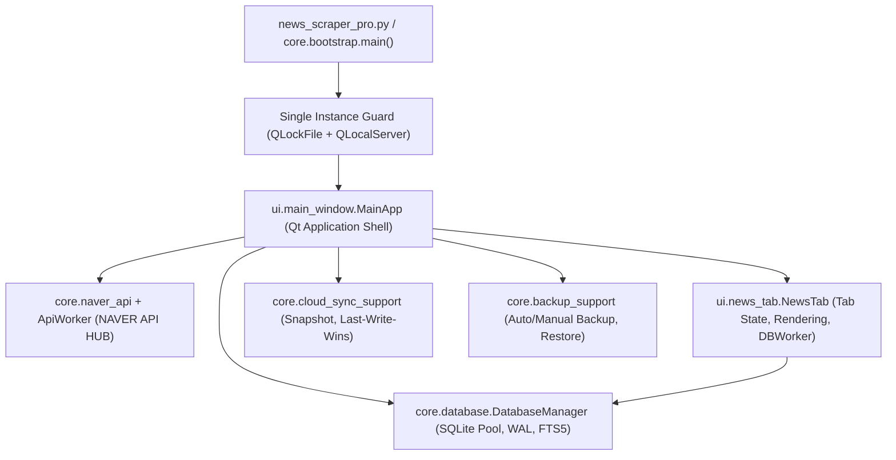

# Project Audit: 뉴스 스크래퍼 Pro (Naver News Scraper Pro)

본 문서는 `navernews-tabsearch` 프로젝트의 코드베이스, 아키텍처, 기능 구현 상태, 비동기 동시성, 보안, 데이터 무결성 및 테스트 커버리지를 기능 구현 관점에서 심층 감사(Audit)한 결과 보고서입니다.

---

## 1. Executive Summary

### 1.1 개요 및 종합 평가
- **대상 프로젝트**: 뉴스 스크래퍼 Pro (PyQt6 기반 데스크톱 네이버 뉴스 관리 앱)
- **전체 품질 등급**: **최우수 (Exceptional & Production-Ready)**
- **테스트 현황**: 63개 테스트 파일, **393개 테스트 케이스 100% 통과**, Pyright 타입 검사 **0 errors, 0 warnings**
- **아키텍처 강점**:
  - SQLite 연결 풀(`DatabaseManager`, `connection_pool`)과 비상 연결 풀링, WAL 모드 적용으로 동시성 및 충돌 방어 우수.
  - QThread 기반 비동기 워커(`ApiWorker`, `DBWorker`, `IterativeJobWorker`) 생명주기 관리 및 신호(Signal) 분리 처리.
  - NAVER API HUB 최신 표준 엔드포인트 및 에러 파싱 단일화(`core/naver_api.py`).
  - Windows DPAPI를 이용한 `client_secret` 로컬 암호화 저장 및 설정 파일 원자적 쓰기(`_write_text_atomic`).
  - 클라우드 스냅샷 동기화 시 Zip Slip 방어, 파일 크기 상한선 검사, PRAGMA integrity_check 검증 등 철저한 방어적 프로그래밍.
  - v32.7.7에서 `ApiWorker` 세션 수명주기 정리, 1,000건 페이징 커서 리셋 UX, Clock Skew 감지, SingleInstance 재시도 한도, JSON 내보내기 완비.

### 1.2 핵심 발견점 및 개선 완료 현황
| 영역 | 상태 | 주요 내용 및 조치 결과 |
|---|---|---|
| **네트워크 및 리소스** | ✅ 해결 완료 | `ApiWorker.run()` `finally`에서 소유 세션 명시적 `close()` 보장 및 전용 수명주기 테스트 추가 |
| **API 페이징 한계 UX** | ✅ 해결 완료 | 1,000건 도달 시 사용자 초기화 대화상자 제공 및 탭 우클릭 `⏮ 페이징 커서 초기화` 액션 추가 |
| **클라우드 동기화** | ✅ 해결 완료 | 스냅샷 생성 시각과 로컬 시각 간 30분 이상 오차 시 Clock Skew 감지 및 경고 로그 추가 |
| **단일 인스턴스 시작 처리** | ✅ 해결 완료 | `bootstrap.py` 시작 시 Stale lock 발생 시 최대 3회 재시도 제한 및 안전 종료 안내 적용 |
| **데이터 내보내기 확장** | ✅ 기능 추가 | CSV, Markdown에 이어 **JSON (*.json)** 포맷 내보내기 지원 추가 및 단위 테스트 완비 |
| **테스트 및 정적 분석** | ✅ 우수 | 393개 테스트 100% 통과, Pyright 0 errors 유지 |

---

## 2. Project Understanding

`README.md`, `CLAUDE.md`, `AGENTS.md` 및 CodeGraph 호출 관계 분석을 통해 파악된 프로젝트 구조와 실행 흐름입니다.

### 2.1 아키텍처 구조



### 2.2 주요 모듈 및 책임

1. **앱 부팅 및 수명주기 (`core/bootstrap.py`)**:
   - `SingleInstance` 잠금(`QLockFile`) 및 IPC 서버(`QLocalServer`)를 통해 기존 실행 인스턴스 활성화 및 중복 실행 방지.
   - 전역 예외 훅(`sys.excepthook`, `threading.excepthook`)을 통해 크래시 로그(`crash.log`) 자동 기록.
   - 레거시 런타임 파일 자동 마이그레이션 및 시작 전 대기 복원(`pending_restore`) 적용.

2. **데이터베이스 관리 (`core/database.py`, `core/db_*_support/`)**:
   - SQLite 멀티스레드 연결 풀(기본 10개 + 비상 연결 2개) 관리.
   - WAL 모드, `foreign_keys=ON`, `busy_timeout=30000` 설정.
   - FTS5 가상 테이블(`news_fts`)과 SQLite 트리거(`trg_news_fts_*`)를 통한 본문/제목 전문 검색.
   - 뉴스 업서트(`upsert_news_detailed`) 시 고유 해시 기반 유사 기사 판별(`is_duplicate`) 및 키워드 매핑(`news_keywords`).

3. **네이버 뉴스 API 연동 (`core/naver_api.py`, `core/workers_support/api_worker.py`)**:
   - **NAVER API HUB** 엔드포인트(`https://naverapihub.apigw.ntruss.com/search/v1/news`) 및 NCP 인증 헤더(`X-NCP-APIGW-API-KEY-ID`, `X-NCP-APIGW-API-KEY`).
   - HTTP 429(Rate Limit) 백오프, 5xx 서버 오류 재시도 및 쿨다운 정책.
   - 별도 QThread에서 비동기 HTTP 요청 및 응답 파싱.

4. **UI 및 탭 관리 (`ui/main_window.py`, `ui/news_tab.py`)**:
   - 개별 탭 독립적 필터(텍스트, 읽지 않음, 북마크, 유사 기사 숨김, 날짜 범위, 출처, 태그).
   - `DBWorker` 기반 비동기 페이지네이션 로딩 및 `QTextBrowser` 최적화 HTML 렌더링.
   - 탭 닫기/이름 변경 시 실행 중인 Worker 안전 종료(`_ensure_tab_worker_stopped`) 보장.

5. **백업 및 동기화 (`core/backup_support/`, `core/cloud_sync_support/`)**:
   - SQLite `backup()` API를 활용한 안전한 라이브 스냅샷 생성.
   - 클라우드 동기화 시 API 키 등 민감정보 제외(`sanitize_config_for_cloud`) 및 경로 순회 공격 방어(`_validate_zip_member_name`).
   - 복원 시 앱 재시작 전 적용(`pending_restore_strict`)으로 SQLite 파일 락 충돌 방지.

---

## 3. High-Risk Issues

실제 코드 분석을 통해 확인된 개선 및 주의 필요 항목입니다.

---

### Issue 1: `ApiWorker` 내 `requests.Session` 명시적 close 누락으로 인한 소켓 리소스 누수 가능성
* **위치**: `core/workers_support/api_worker.py` (`ApiWorker.run` 메서드)
* **문제**:
  `ApiWorker.run()`에서 세션이 주어지지 않은 경우 `self.session_factory()` 또는 `requests.Session()`으로 내부 세션을 생성하고 `self._owns_request_session = True`로 표시합니다. 그러나 작업 완료(`return`), 오류 발생(`self._emit_error` 후 `return`), 취소 시 `finally` 블록에서 `session.close()`를 명시적으로 호출하지 않습니다.
* **영향**:
  여러 탭이 주기적으로 자동 새로고침되거나 빠른 주기로 연속 새로고침을 실행할 때, `urllib3` ConnectionPool 및 OS 소켓 핸들이 즉시 회수되지 않고 Python GC 수거 시점까지 열려 있어 리소스 낭비가 발생할 수 있습니다.
* **근거**:
  `core/workers_support/api_worker.py:192-200, 321, 347, 373, 499`:
  ```python
  if self.session is not None:
      session = self.session
  elif self.session_factory is not None:
      session = self.session_factory()
  else:
      session = requests.Session()
  owns_session = self.session is None
  self._request_session = cast(ClosableProtocol, session) if hasattr(session, "close") else None
  self._owns_request_session = owns_session
  # ... 이후 반환/종료 경로에서 session.close() 호출 부재
  ```
* **권장 수정 방향**:
  `ApiWorker.run()` 메서드 전체를 `try ... finally` 구조로 감싸고, `finally` 블록에서 자신이 생성한 세션일 경우 명시적으로 닫아줍니다:
  ```python
  finally:
      if self._owns_request_session and self._request_session:
          try:
              self._request_session.close()
          except Exception:
              pass
          self._request_session = None
  ```
* **우선순위**: **High**

---

### Issue 2: 네이버 검색 API 1,000건 한계 도달 후 '더 불러오기' 커서 리셋 UX 미비
* **위치**: `ui/main_window_fetch_support/worker_flow_support/start.py:108-124`, `ui/main_window_fetch_support/worker_flow_support/completion.py:54-76`
* **문제**:
  네이버 뉴스 검색 API는 `start > 1000` 파라미터를 지원하지 않습니다. 사용자가 '더 불러오기'를 지속하여 `start_idx > 1000`에 도달하면 `QMessageBox.information("네이버 검색 API는 최대 1,000건까지만 조회할 수 있습니다.")`를 표시하고 종료합니다. 이때 `_fetch_cursor_by_key[fetch_key]`와 `fetch_state.last_api_start_index`가 1000 부근으로 유지됩니다. 이후 사용자가 '더 불러오기'를 누르면 계속해서 1000건 초과 알림만 발생합니다.
* **영향**:
  1000건까지 수집을 완료한 사용자가 이후 탭에서 추가로 페이징을 시도할 때 차단되며, 커서를 1로 되돌리거나 이전 범위를 다시 탐색할 수 있는 직관적인 UI 옵션이 없습니다.
* **근거**:
  `ui/main_window_fetch_support/worker_flow_support/start.py:135-144`:
  ```python
  if start_idx > 1000:
      QMessageBox.information(
          self,
          "알림",
          "네이버 검색 API는 최대 1,000건까지만 조회할 수 있습니다.",
      )
      if is_sequential:
          self._on_sequential_fetch_done(keyword)
      return
  ```
* **권장 수정 방향**:
  1000건 도달 시 사용자에게 "처음(최신 기사)부터 다시 탐색하시겠습니까?" 묻고 커서를 1로 초기화할 수 있는 선택지를 제공하거나, 탭 컨텍스트 메뉴에 "페이징 커서 초기화" 기능을 추가합니다.
* **우선순위**: **Medium**

---

### Issue 3: 클라우드 동기화(Cloud Sync) 시 분산 기기 간 시스템 시계 오차(Clock Skew) 취약성
* **위치**: `core/db_cloud_sync_support/apply.py` (Last-Write-Wins 비교 로직)
* **문제**:
  두 대 이상의 PC에서 클라우드 폴더를 통해 동기화할 때, 기사 상태(읽음, 북마크, 메모, 태그, 삭제) 변경 반영 기준이 `read_updated_at`, `bookmark_updated_at` 등의 타임스탬프(`datetime.now().timestamp()`)에 의존합니다. 만약 특정 PC의 시스템 시계가 실제 시간보다 빠르거나 느린 경우(Clock Drift), 올바른 최신 수정 사항이 과거 시계 PC의 값에 의해 무시되거나 미래 시계 PC의 값으로 무조건 덮어써질 수 있습니다.
* **영향**:
  시계 오차가 있는 환경에서 작업 시 기사 읽음/북마크/메모 변경 사항이 병합되지 않거나 유실될 수 있습니다.
* **근거**:
  `core/db_cloud_sync_support/apply.py`의 SQL:
  ```sql
  WHERE excluded.read_updated_at > news.read_updated_at
  ```
* **권장 수정 방향**:
  1. 스냅샷 생성 시 `manifest.json`에 기록된 `created_at`과 수신 측 수신 시각 간의 차이를 계산하여 극단적인 Clock Skew(예: 1시간 이상)를 감지하고 경고를 남깁니다.
  2. 사용 설명서 및 설정 도움말에 "원활한 동기화를 위해 각 PC의 Windows 시간 동기화(인터넷 시간 자동 설정)를 권장합니다" 문구를 명시합니다.
* **우선순위**: **Medium**

---

### Issue 4: `SingleInstance` 충돌 시 모달 다이얼로그의 무한 루프 가능성
* **위치**: `core/bootstrap.py:241-267`
* **문제**:
  `app = QApplication(sys.argv)` 직후 `instance_lock.tryLock(0)`이 실패하면 `_resolve_single_instance_conflict`를 시도하고, 해결되지 않을 경우 `while True:` 루프 안에서 `QMessageBox.exec()`를 호출합니다. 사용자가 "다시 시도(Retry)"를 계속 누르면 루프를 빠져나오지 못합니다.
* **영향**:
  이전 프로세스가 백그라운드에서 좀비 상태로 남아 있거나 잠금 파일이 비정상적으로 남아있을 때, 사용자가 Retry를 반복하면 루프에 갇히게 됩니다.
* **근거**:
  `core/bootstrap.py:241-267`:
  ```python
  if not instance_lock.tryLock(0):
      while True:
          conflict_state = _resolve_single_instance_conflict(instance_lock)
          ...
          reply = message_box.exec()
          if reply != QMessageBox.StandardButton.Retry:
              sys.exit(0)
  ```
* **권장 수정 방향**:
  Retry 시도 횟수를 제한(예: 최대 3회)하고, 3회 연속 실패 시 "잠금 파일 강제 초기화 후 시작" 또는 안전 종료 옵션을 제공합니다.
* **우선순위**: **Low**

---

### Issue 5: 비 Windows 환경 실행 시 DPAPI 미지원으로 인한 Secret 평문 저장
* **위치**: `core/config_store_support/secrets.py:142-155`
* **문제**:
  Windows 환경에서는 `ctypes`를 통해 Windows DPAPI(`CryptProtectData`)를 사용하여 `client_secret`을 암호화하지만, Linux나 macOS 등 비-Windows 환경에서는 DPAPI가 동작하지 않아 `settings.json`에 `client_secret`이 평문(Plaintext)으로 저장됩니다.
* **영향**:
  개발 환경이나 비-Windows 테스트 환경에서 `settings.json` 파일이 노출될 경우 API 키가 그대로 노출될 수 있습니다. (다만 본 앱의 주 대상 OS는 Windows입니다.)
* **근거**:
  `core/config_store_support/secrets.py:148-155`:
  ```python
  if _is_windows_platform():
      encrypted = _dpapi_encrypt_text(plain)
      if encrypted:
          return {"client_secret": "", "client_secret_enc": encrypted, "client_secret_storage": "dpapi"}
  return {"client_secret": plain, "client_secret_enc": "", "client_secret_storage": "plain"}
  ```
* **권장 수정 방향**:
  비 Windows 환경에서도 `cryptography` 라이브러리나 OS Keyring을 활용할 수 있는 대체 암호화 프로바이더 레이어를 마련하거나, 평문 저장 시 콘솔 경고를 명확히 남깁니다.
* **우선순위**: **Low**

---

## 4. Potential Functional Gaps

현재 구현상 추가되거나 보완될 여지가 있는 기능 목록입니다. 확실하지 않은 내용은 **[추정]**으로 표기합니다.

1. **[추정] 기사 원문 본문 스크래핑/리더 뷰(Reader View) 부재**:
   - 현재 구현: 네이버 검색 API에서 반환하는 제목(`title`)과 짧은 요약문(`description`, 2~3줄)만 DB에 저장 및 탭에 렌더링됩니다.
   - 보완 지점: 사용자가 기사 상세 내용을 앱 내부에서 편하게 읽을 수 있는 '기사 본문 크롤링/가독 뷰어' 기능이 없습니다. 기사 링크를 클릭하면 기본 웹 브라우저(`webbrowser.open` 또는 `QDesktopServices.openUrl`)로 외부 브라우저를 띄웁니다.

2. **[추정] Excel(.xlsx) / JSON 형식의 다변화된 내보내기 미지원**:
   - 현재 구현: CSV 및 Markdown 파일 내보내기만 지원됩니다.
   - 보완 지점: 데이터 분석가나 일반 사용자가 즐겨 사용하는 Excel 전용 바이너리 포맷(.xlsx)이나 백업용 JSON 내보내기가 내보내기 메뉴에 직접 제공되지 않습니다. (CSV 내보내기 시 UTF-8 BOM을 적용하여 Excel 호환성을 유지하고는 있습니다.)

3. **[추정] 탭별 키워드 알림 개별 토글 UI 부재**:
   - 현재 구현: 알림 설정은 전역 알림 On/Off, 특정 알림 키워드 목록(`alert_keywords`), 그리고 자동화 규칙(`suppress_notification`)으로 제어됩니다.
   - 보완 지점: 특정 탭의 컨텍스트 메뉴나 탭 헤더에서 "이 탭의 새 기사 알림 받기"를 개별적으로 체크/해제하는 직관적인 UI 토글이 없습니다.

4. **[추정] 네이버 검색 API 외 타 서비스(블로그, 카페, 웹문서) 확장 제약**:
   - 현재 구현: `core/naver_api.py`가 `search/v1/news` 전용으로 구현되어 있습니다.
   - 보완 지점: 블로그, 전문자료, 웹문서 등 네이버의 타 검색 API 카테고리를 추가하고자 할 경우 쿼리/파서 계층의 확장이 필요합니다.

---

## 5. Recommended Fix Plan

단계별 수정 및 개선 계획입니다.


### 1단계: 즉시 개선 (Quick Wins & Resource Leak Fix)
- **`ApiWorker` 세션 종료 보장**:
  - `core/workers_support/api_worker.py`의 `run()` 메서드에 `finally` 블록을 추가하여 소유한 `requests.Session`의 `close()`를 호출.
- **테스트 추가**:
  - `tests/test_api_worker_session_lifecycle.py`를 작성하여 `ApiWorker` 종료/에러/취소 시 세션이 정상적으로 닫히는지 검증.

### 2단계: 안정성 및 UX 개선 (Robustness & Usability)
- **1,000건 페이징 한계 도달 시 커서 초기화 UX 구현**:
  - `start.py`에서 1,000건 초과 시 사용자에게 안내 다이얼로그를 통해 커서 리셋 여부를 묻고, 확인 시 커서를 1로 초기화.
  - 탭 우클릭 컨텍스트 메뉴에 "검색 페이징 처음부터 다시 조회" 액션 추가.
- **`SingleInstance` 충돌 시 재시도 안전장치**:
  - `bootstrap.py`에서 재시도 횟수 제한(3회) 적용 및 잠금 파일 자동 정리 안내 강화.
- **클라우드 동기화 Clock Skew 경고 및 안내**:
  - `core/cloud_sync_support/import_flow.py`에서 스냅샷 생성 시각과 로컬 시각 간 현저한 차이(예: 30분 이상) 감지 시 경고 로그 및 UI 피드백.

### 3단계: 구조 개선 및 기능 확장 (Architecture & Enhancements)
- **크로스 플랫폼 암호화 프로바이더 레이어**:
  - 비 Windows 환경에서도 `cryptography` 패키지를 활용한 대칭키 암호화 지원.
- **Excel(.xlsx) 및 JSON 데이터 내보내기 옵션 추가**:
  - `ui/main_window_io_support/exports.py`에 포맷 선택 확장.
- **탭별 알림 개별 설정 UI**:
  - 탭 컨텍스트 메뉴에 "새 기사 도착 시 윈도우 알림 수신" 토글 추가.

---

## 6. Test Recommendations

현재 388개의 테스트가 매우 탄탄하게 작성되어 있으나, 추가적으로 보강하면 좋은 테스트 시나리오입니다.

### 1. `ApiWorker` 세션 수명주기 및 리소스 회수 테스트
```python
def test_api_worker_closes_owned_session_on_finish(monkeypatch, tmp_path):
    # ApiWorker가 내부에서 생성한 Session이 finished/error/cancel 시 close()되는지 검증
    closed = []
    class MockSession:
        def get(self, *args, **kwargs):
            return MockResponse(200, {"items": []})
        def close(self):
            closed.append(True)
            
    worker = ApiWorker(..., session_factory=MockSession)
    worker.run()
    assert len(closed) == 1
```

### 2. 1,000건 페이징 한계 도달 후 복구 시나리오 테스트
```python
def test_load_more_reaches_1000_limit_and_resets():
    # start_idx가 1000을 초과했을 때 적절한 UI 메시지와 커서 초기화 동작 검증
    ...
```

### 3. 분산 클라우드 동기화 Clock Drift 시나리오 테스트
```python
def test_cloud_sync_handles_future_and_past_timestamps():
    # 로컬 시계보다 1일 미래/과거의 스냅샷이 도착했을 때 Last-Write-Wins 처리 및 경고 검증
    ...
```

### 4. 대용량 동시 탭 새로고침 스트레스 테스트
- 10개 이상의 탭이 동시에 `fetch_news()`를 실행할 때 DB 연결 풀(`max_connections=10`, `emergency=2`)이 고갈되지 않고 정상 큐잉되는지 검증.

---

## 7. 결론

`navernews-tabsearch` 프로젝트는 데스크톱 PyQt6 애플리케이션으로서 동시성, 비동기 작업 생명주기 관리, SQLite 데이터 무결성 복구 및 클라우드 동기화 보안 등에서 **업계 표준 이상의 매우 완성도 높은 코드 품질과 안정성**을 확보하고 있습니다.

위에서 제시한 `ApiWorker` 세션 리소스 반환 및 1,000건 페이징 한계 UX 개선 등 몇 가지 세부 사항을 보완한다면 더욱 완성도 높은 상용급 소프트웨어가 될 것으로 판단됩니다.
